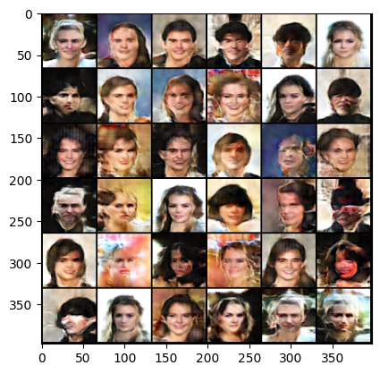

# DCGAN

## Examples of generated images
Below you can see examples of faces generated after training the network on the CelebFaces Attributes (CelebA) Dataset from kaggle, that can be found on kaggle <https://www.kaggle.com/datasets/jessicali9530/celeba-dataset>

    

## How the model works
The network is a *Generative Adverarial Network*, which means that it consists of two networks that try to outperform each other.  
The *Generator*-model generates new instances of images, from a random distribution of numbers. 

## Install 
In order to run the training and the generation of images, you will need to install the requirements from the requirements file.  
Either install locally or create a new python virtual environment. 

Run: **pip install -r requirements.txt**
Afterwards you can install the local package dcgan by running **pip install -e .**  
This will make sure that the imports of local files will work correctly. 

## Training
In order to train the Model run: **python dcgan/training/train_model.py**  
in the *dcgan/model_params/params.yaml*, you will find the hyper parameters. Here you can change training parameters and add the path to the file containing your own training data.  
In the future I will add an argparser, so the parameters can be changed from the prompt.

